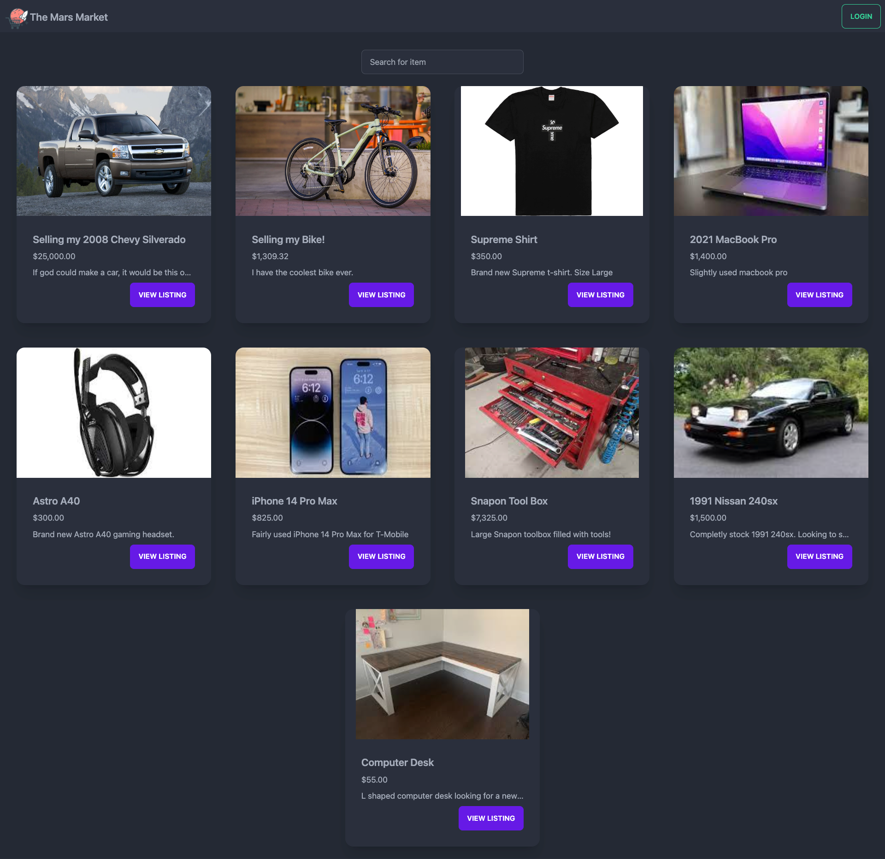

# The Mars Market

## Table of Contents:

- [Description](#description)
- [Installation](#installation)
- [Usage](#usage)
- [License](#license)
- [Contributions](#contributions)
- [Tests](#tests)
- [Questions](#questions)

## Description:

- Looking for the next out of this world marketplace? Check out The Mars Market featuring a seamless user experience allowing for easy browsing and fast checkout! Signing up only takes seconds so give it a try today.

## Installation:

- You must have the following for the application to function correctly:
- Navigate to the repository and perform git clone in the destination you prefer. After cloning the repository, perform "npm install". Lastly, run "npm run develop" in the root directory to start the front end and back end at the same time.

## Usage

- When on the homepage, create or sign in to your account. From there the user can list items for sale, browse items for sale, and edit their profile info and add a profile picture.

## License

- license : MIT 

- https://opensource.org/licenses/MIT

## Contributions

- Riley Newhart
- Alberto Suarez

## Deployed Application

- https://www.themarsmarket.com

## Questions

- Have any questions? You can contact us here.
- Github: https://github.com/Rilaey
- Github: https://github.com/albertosuarez8
